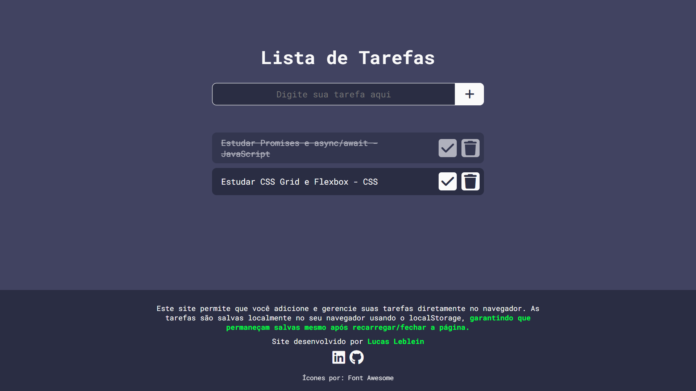

# Gerenciador de Tarefas: To-Do List Web

Este projeto é um gerenciador de tarefas web criado para permitir que você adicione, marque como concluídas ou exclua tarefas da sua lista. As tarefas são salvas localmente no navegador, garantindo que permaneçam disponíveis mesmo após fechar a página.

## 🌐 Acesse a versão online
👉 [Visite meu Gerenciador de Tarefas online](https://lucas-ldev.github.io/)

## 🚀 Tecnologias utilizadas
 

## 🛠️ Recursos
- Adicionar tarefas
- Excluir tarefas
- Marcar tarefas como concluídas
- Tarefas salvas localmente no navegador via localStorage

## 🌟 Demonstração  
  
A imagem acima mostra uma prévia do funcionamento do gerenciar de tarefas.